# Walmart TrustShield 360 - System Architecture

## Overview
TrustShield 360 is a comprehensive cybersecurity platform for Walmart that combines AI/ML fraud detection, blockchain immutability, quantum-resistant cryptography, and real-time monitoring to protect retail transactions and customer data.

## System Architecture Diagram

```mermaid
graph TB
    %% User Interface Layer
    subgraph "🎨 User Interface Layer"
        UI[Next.js Web App<br/>TrustShield 360 Dashboard]
        CLI[TrustShield CLI<br/>Command Line Interface]
        MOBILE[Mobile App<br/>Customer Interface]
    end

    %% Authentication & Authorization
    subgraph "🔐 Authentication Layer"
        CLERK[Clerk Authentication<br/>User Management]
        MFA[Multi-Factor Auth<br/>Biometric Verification]
        ZERO_TRUST[Zero Trust Challenge<br/>Context Validation]
    end

    %% API Gateway Layer
    subgraph "🌐 API Gateway Layer"
        API[Next.js API Routes<br/>RESTful Endpoints]
        MIDDLEWARE[Middleware<br/>Request Processing]
    end

    %% Core Security Services
    subgraph "🛡️ Core Security Services"
        CORTEX[AI Cortex<br/>Fraud Detection Engine]
        VISION[Vision Guard<br/>Computer Vision]
        QUANTUM[Quantum Handshake<br/>PQC Cryptography]
        BLOCKCHAIN[Blockchain Logger<br/>Immutable Ledger]
        TRUST[Trust Score Engine<br/>Reputation System]
    end

    %% AI/ML Processing
    subgraph "🧠 AI/ML Processing Layer"
        TAB_TRANS[TabTransformer<br/>Transaction Analysis]
        GNN[Graph Neural Network<br/>Fraud Ring Detection]
        ANALYTICS[Analytics Engine<br/>Pattern Recognition]
        EXPLAIN[Explainability<br/>SHAP Analysis]
    end

    %% Data Storage Layer
    subgraph "💾 Data Storage Layer"
        NEO4J[(Neo4j Graph Database<br/>Fraud Rings & Relationships)]
        POSTGRES[(PostgreSQL<br/>Transaction Data)]
        S3[(AWS S3<br/>Model Artifacts & Logs)]
        REDIS[(Redis Cache<br/>Session & Trust Scores)]
    end

    %% External Integrations
    subgraph "🔗 External Integrations"
        IPQS[IP Quality Score<br/>IP Reputation]
        ABUSEIPDB[AbuseIPDB<br/>Threat Intelligence]
        GROQ[Groq AI<br/>Copilot Assistant]
    end

    %% Blockchain Infrastructure
    subgraph "⛓️ Blockchain Infrastructure"
        HARDHAT[Hardhat Network<br/>Local Development]
        SMART_CONTRACTS[Smart Contracts<br/>TransactionLedger.sol]
        ETHERS[Ethers.js<br/>Blockchain Integration]
    end

    %% Monitoring & Alerting
    subgraph "📊 Monitoring & Alerting"
        MONITORING[Real-time Monitoring<br/>Event Stream]
        ALERTS[Alert System<br/>Fraud Notifications]
        HEALTH[System Health<br/>Performance Metrics]
    end

    %% Data Flow Connections
    UI --> API
    CLI --> API
    MOBILE --> API
    
    API --> CLERK
    API --> MFA
    API --> ZERO_TRUST
    
    API --> CORTEX
    API --> VISION
    API --> QUANTUM
    API --> BLOCKCHAIN
    API --> TRUST
    
    CORTEX --> TAB_TRANS
    CORTEX --> GNN
    CORTEX --> ANALYTICS
    CORTEX --> EXPLAIN
    
    TAB_TRANS --> NEO4J
    GNN --> NEO4J
    ANALYTICS --> POSTGRES
    TRUST --> REDIS
    
    API --> IPQS
    API --> ABUSEIPDB
    API --> GROQ
    
    BLOCKCHAIN --> HARDHAT
    BLOCKCHAIN --> SMART_CONTRACTS
    BLOCKCHAIN --> ETHERS
    
    API --> MONITORING
    API --> ALERTS
    API --> HEALTH
    
    %% Data Flow Styling
    classDef userInterface fill:#e1f5fe,stroke:#01579b,stroke-width:2px
    classDef security fill:#fff3e0,stroke:#e65100,stroke-width:2px
    classDef ai fill:#f3e5f5,stroke:#4a148c,stroke-width:2px
    classDef storage fill:#e8f5e8,stroke:#1b5e20,stroke-width:2px
    classDef external fill:#ffebee,stroke:#b71c1c,stroke-width:2px
    classDef blockchain fill:#fff8e1,stroke:#f57f17,stroke-width:2px
    classDef monitoring fill:#fce4ec,stroke:#880e4f,stroke-width:2px
    
    class UI,CLI,MOBILE userInterface
    class CLERK,MFA,ZERO_TRUST,CORTEX,VISION,QUANTUM,BLOCKCHAIN,TRUST security
    class TAB_TRANS,GNN,ANALYTICS,EXPLAIN ai
    class NEO4J,POSTGRES,S3,REDIS storage
    class IPQS,ABUSEIPDB,GROQ external
    class HARDHAT,SMART_CONTRACTS,ETHERS blockchain
    class MONITORING,ALERTS,HEALTH monitoring
```

## Key Components

### 🎨 User Interface Layer
- **Next.js Web App**: Modern React-based dashboard with real-time fraud visualization
- **TrustShield CLI**: Command-line interface for security operations
- **Mobile App**: Customer-facing interface for secure transactions

### 🔐 Authentication Layer
- **Clerk Authentication**: User management and session handling
- **Multi-Factor Auth**: Biometric verification and device recognition
- **Zero Trust Challenge**: Context-aware authentication validation

### 🛡️ Core Security Services
- **AI Cortex**: Main fraud detection engine using ensemble ML models
- **Vision Guard**: Computer vision for identity verification
- **Quantum Handshake**: Post-quantum cryptography (CRYSTALS-Kyber)
- **Blockchain Logger**: Immutable transaction logging
- **Trust Score Engine**: Dynamic reputation and risk scoring

### 🧠 AI/ML Processing Layer
- **TabTransformer**: Transaction pattern analysis
- **Graph Neural Network**: Fraud ring detection using graph analytics
- **Analytics Engine**: Real-time pattern recognition
- **Explainability**: SHAP-based model explanations

### 💾 Data Storage Layer
- **Neo4j**: Graph database for fraud ring relationships
- **PostgreSQL**: Transaction and user data storage
- **AWS S3**: Model artifacts and audit logs
- **Redis**: Session management and trust score caching

### 🔗 External Integrations
- **IP Quality Score**: IP reputation and threat intelligence
- **AbuseIPDB**: Known malicious IP detection
- **Groq AI**: AI-powered security copilot assistant

### ⛓️ Blockchain Infrastructure
- **Hardhat Network**: Local blockchain development environment
- **Smart Contracts**: Solidity contracts for transaction logging
- **Ethers.js**: Blockchain integration library

### 📊 Monitoring & Alerting
- **Real-time Monitoring**: Live event streaming and analysis
- **Alert System**: Fraud detection notifications
- **System Health**: Performance and availability metrics

## Data Flow

1. **Transaction Initiation**: User initiates transaction through web/mobile app
2. **Authentication**: Multi-factor authentication and zero-trust validation
3. **AI Analysis**: TabTransformer and GNN models analyze transaction patterns
4. **Risk Assessment**: Trust score engine evaluates overall risk
5. **Blockchain Logging**: Immutable transaction record creation
6. **Real-time Monitoring**: Continuous monitoring and alerting
7. **Response**: Automated or manual intervention based on risk level

## Security Features

- **Quantum-Resistant Cryptography**: CRYSTALS-Kyber for future-proof security
- **Graph Analytics**: Advanced fraud ring detection
- **Explainable AI**: Transparent decision-making process
- **Immutable Logging**: Blockchain-based audit trail
- **Real-time Monitoring**: Continuous threat detection
- **Multi-layered Defense**: Defense in depth approach

## Technology Stack

- **Frontend**: Next.js 15, React 19, TypeScript, Tailwind CSS
- **Backend**: Python (FastAPI), Node.js, TypeScript
- **AI/ML**: PyTorch, scikit-learn, Graph Neural Networks
- **Database**: Neo4j, PostgreSQL, Redis
- **Blockchain**: Ethereum, Solidity, Hardhat
- **Cloud**: AWS S3, Vercel deployment
- **Security**: Clerk Auth, libsodium, quantum-resistant algorithms

> Built by Team Agesis 360 for Walmart Sparkathon'25.